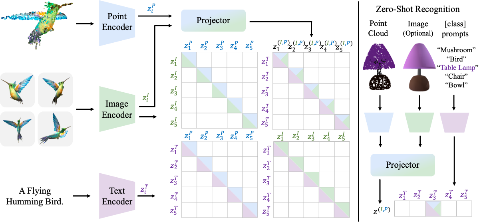

# MixCon3D: Synergizing Multi-View and Cross-Modal Contrastive Learning for Enhancing 3D Representation
This repository contains the official implementation of "MixCon3D" in our paper.

<p align="center">
  
Overview of the MixCon3D. We integrate the image and point cloud modality information, formulating a holistic 3D instance-level representation for cross-modal alignment.
</p>

## News
**[2023.11.2]** We release the training code of the MixCon3D.

## Installation
Please refer to this [instruction](https://github.com/UCSC-VLAA/MixCon3D/blob/main/Installation.md) for step-by-step installation guidance. Both the necessary packages and some helpful debug experience are provided.
## Data Downloading
First, modify the path in the download_data.py.
Then, execute the following command to download data from Hugging Face:
```python
python3 download_data.py
```
The datasets used for experiments are the same as [OpenShape](https://github.com/Colin97/OpenShape_code).
Please refer to OpenShape for more details of the data.

## Training
To train the PointBERT model using the MixCon3D, please change the [data_path] to your specified local data path.
Then, running the following command:

1) On an 8 GPU server, training with batchsize 2048
```python
torchrun --nproc_per_node=8 src/main.py --ngpu 8 dataset.folder=data_path dataset.train_batch_size=256 model.name=PointBERT model.scaling=3 model.use_dense=True --trial_name MixCon3D --config src/configs/train.yaml
```
2) If the GPU memory is not enough, you can lower the train_batch_size and run with a specific accumulated iter num as follows (The equivalent batchsize = train_batch_size * accum_freq):
```python
torchrun --nproc_per_node=8 src/main.py --ngpu 8 dataset.folder=data_path dataset.train_batch_size=128 dataset.accum_freq=2 model.name=PointBERT model.scaling=3 model.use_dense=True --trial_name MixCon3D --config src/configs/train.yaml
```

To train on different datasets, use the following command:

(Ensemble_no_LVIS)
```python
torchrun --nproc_per_node=8 src/main.py --ngpu 8 dataset.folder=data_path dataset.train_split=meta_data/split/train_no_lvis.json dataset.train_batch_size=128 dataset.accum_freq=2 model.name=PointBERT model.scaling=3 model.use_dense=True --trial_name MixCon3D --config src/configs/train.yaml
```
(ShapeNet_only)
```python
torchrun --nproc_per_node=8 src/main.py --ngpu 8 dataset.folder=data_path dataset.train_split=meta_data/split/ablation/train_shapenet_only.json dataset.train_batch_size=128 dataset.accum_freq=1 model.name=PointBERT model.scaling=3 model.use_dense=True --trial_name MixCon3D --config src/configs/train.yaml
```

We use the [wandb](https://wandb.ai/) for logging.

## Acknowledgment
This codebase is based on [OpenShape](https://github.com/Colin97/OpenShape_code), [timm](https://github.com/huggingface/pytorch-image-models) and [PointBERT](https://github.com/lulutang0608/Point-BERT). Thanks to the authors for their awesome contributions! This work is partially supported by TPU Research Cloud (TRC) program and Google Cloud Research Credits program.

## Citation

```
@article{gao2023mixcon3d,
  title={MixCon3D: Synergizing Multi-View and Cross-Modal Contrastive Learning for Enhancing 3D Representation},
  author={Yipeng Gao and Zeyu Wang and Wei-Shi Zheng and Cihang Xie and Yuyin Zhou},
  journal={arXiv preprint arXiv:2311.01734},
  year={2023},
}
```

## Contact 
Questions and discussions are welcome via [gaoyp23@mail2.sysu.edu.cn](gaoyp23@mail2.sysu.edu.cn) or open an issue here.


